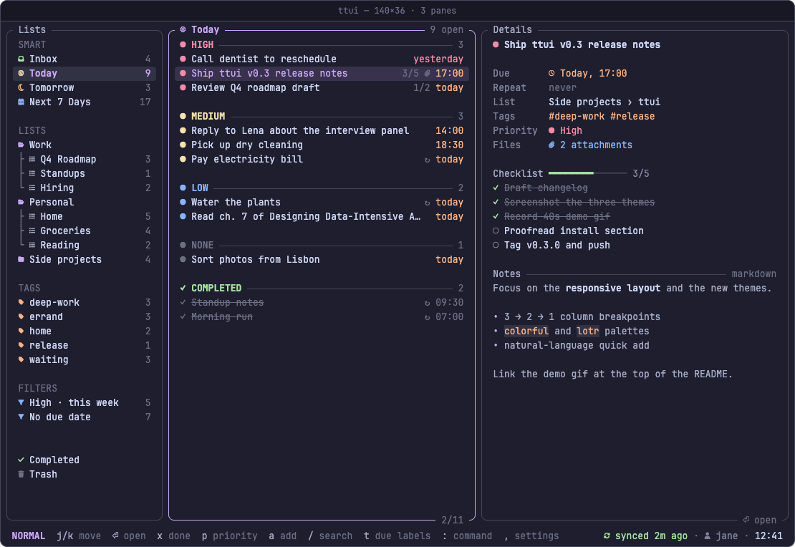

# ttui: TickTick in your terminal



Your TickTick lists, tasks and notes in a fast, keyboard-first terminal app.
Three panes that adapt to your window, a command bar that understands `call mom tomorrow 17:00 !high`,
and themes that match your terminal, all synced live with your TickTick account.
Inspired by [superfile](https://superfile.dev): clean, minimal, never leave the keyboard.

## Features

- **Responsive layout**: lists · tasks · details at full width, two panes on smaller windows, one pane with a slide-up details sheet on narrow ones.
- **Command bar** (`/`): fuzzy search across tasks, lists and commands; `+` quick add with natural language (`fri 5pm !med #errand @home`); `@` jump to a list; `#` filter by tag.
- **Edit without leaving the keyboard**: complete (`x`, with undo), cycle priority (`p`), pick a due date (`d`), move to another list (`m`), add and tick checklist items (`c`), edit title, tags and markdown notes inline, set repeats. `?` lists every key.
- **Instant and in sync**: edits show at once and are sent in the background; a background sync picks up changes from your other devices; startup renders from a local cache.
- **Smart lists**: Today, Tomorrow, Next 7 Days, tags and filters, with tasks grouped High → Medium → Low → None.
- **Looks like your terminal**: the default theme uses your terminal's own colors; `colorful` and `lotr` are built in, custom themes are one TOML file; transparent backgrounds let your terminal's blur show through.
- **Simple sign-in**: browser OAuth, or paste an API token.

## Install

macOS and Linux (Arch/Omarchy, Debian/Ubuntu/Pop!_OS, Fedora). On Windows, use WSL.

```sh
curl -fsSL https://raw.githubusercontent.com/raccoon-overlord-dev/ticktick-tui/main/install.sh | sh
```

It installs `ttui` to `~/.local/bin` (no sudo) after checking the download's SHA-256, and tells you if that folder needs adding to your `PATH`.
Run it again to upgrade; add `sh -s -- --uninstall` to remove it. Then run:

```sh
ttui
```

A [Nerd Font](https://www.nerdfonts.com) is recommended for icons (you can switch them off in Settings).
Keys, quick-add syntax, configuration and themes: see **[docs/usage.md](docs/usage.md)**.

## Known issues

- On some setups (seen on Omarchy + Ghostty, not on macOS + Ghostty), pressing `↓` with the first task selected draws that task twice. It's only visual: the task isn't duplicated in TickTick.

## How it's built

- **Go** with [Bubble Tea](https://github.com/charmbracelet/bubbletea) and [Lip Gloss](https://github.com/charmbracelet/lipgloss): a single static binary, no runtime to install.
- Talks directly to the **TickTick Open API v1**, signing in with OAuth 2 + PKCE (no client secret involved). What the API can and can't do is documented in [docs/api-notes.md](docs/api-notes.md).
- Designed in **Claude Design** and implemented with **Claude Code**, phase by phase: API exploration, auth, read-only UI, editing and the command bar, then distribution.
- Release archives are built with [GoReleaser](https://goreleaser.com).

Want to contribute or build it yourself? `make test`, `make build`, and `ttui dev demo` to try the UI on mock data (details in [docs/usage.md](docs/usage.md#development)).
What's next: [ROADMAP.md](ROADMAP.md).

License: [MIT](LICENSE).
